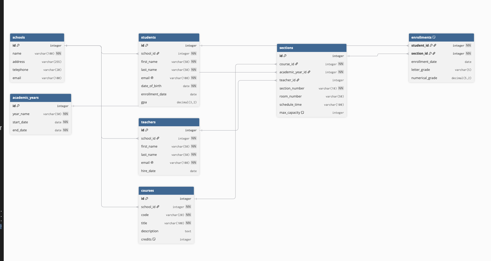

# School Database Design

## Project Description
Design and implement a relational database for a school system from scratch in PostgreSQL, modeling entities including schools, academic years, teachers, students, courses, sections, and enrollments, followed by schema evolution and relationship verification queries.

## Tasks Completed
- Designed relational schema modeling entities, primary keys, and foreign keys
- Created tables for schools, academic years, teachers, students, courses, sections, and enrollments
- Inserted university and course data testing 1-to-many and many-to-many relationships
- Added new columns for school contact emails, section capacities, and numerical grades
- Backfilled missing data for newly added columns
- Added check constraints to enforce positive capacity and valid grade ranges
- Queried student course rosters with course, section, teacher, and grade details
- Calculated total student enrollment count per course
- Computed average numerical grade per course section

## Entity-Relationship Diagram


## Structure
```text
04_school_db/
├── README.md               # Project description, ER diagram, and tasks
└── solution.sql            # Table definitions, seed data, alterations, and queries
```
